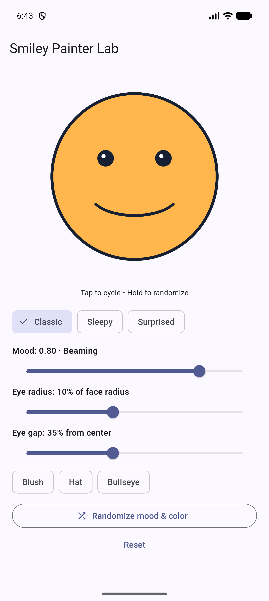
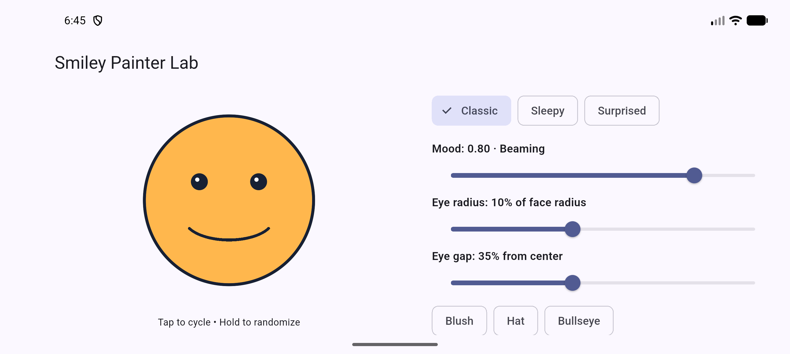
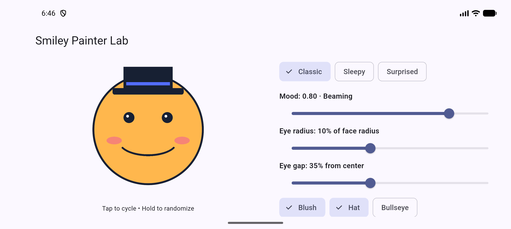
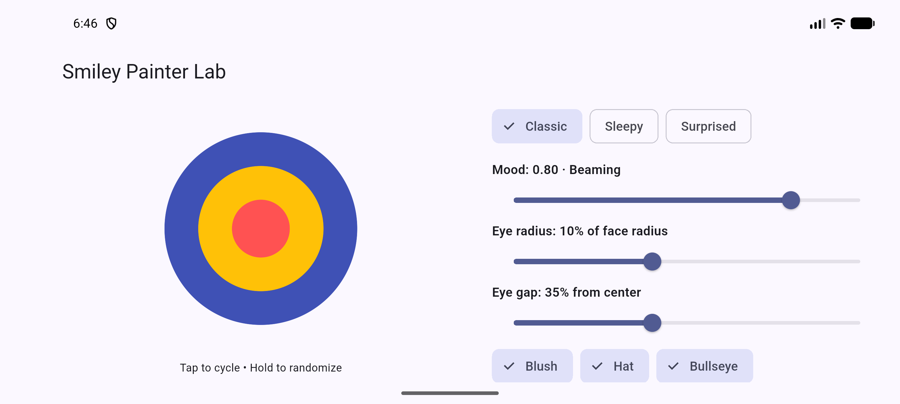

# Activity 06 — Critical thinking

**Blake Cantave · September 30, 2026**

## Measure and improve the smile arc

The face center is `c = Offset(size.width / 2, size.height / 2)` and the radius is `r = size.shortestSide * 0.40`, which keeps the circle inside both canvas dimensions. At mood `0.80`, the Classic smile uses `Rect.fromCenter(center: c + Offset(0, r * 0.22), width: r * 1.05, height: r * 0.50)`, a start angle of `0.15 * pi`, and a clockwise sweep of `0.70 * pi`, giving balanced endpoints on either side of the center. In the Android emulator's release build, the face stayed centered and fully visible in portrait and landscape, and dragging the mood slider near zero immediately produced a blue face with a frown. I changed the fixed 300-by-300 canvas to use the available layout constraints, placed the controls beside the drawing in landscape, and scaled the eyes, mouth, hat, and stroke widths from `r` so the drawing stays proportional as its space changes. `shouldRepaint` returns true when mood, face type, color, eye radius, eye gap, blush, hat, or bullseye changes, and false when those inputs are unchanged, so changed controls redraw correctly without requesting unnecessary repaints on an otherwise unchanged delegate.

### Geometry sketch

```text
                 center x = width / 2
                          |
                   .-------------.
                 /                 \
                |    eye     eye    |
                |         c         |  center y = height / 2
                |   +-----------+   |
                |   | mouth oval|   |  oval center = c + (0, 0.22r)
                |    \_________/    |  width = 1.05r, height = 0.50r
                 \                 /
                   '-------------'
                   face radius = r

Smile arc: 27 degrees to 153 degrees, clockwise (0.15π + 0.70π).
Canvas y increases downward, so this traces the lower side of the oval.
```

### Phone-emulator evidence

Portrait, release APK:



Landscape, same release APK and mood:



## Paint-order explanation

The hat is drawn after the face, so its brim covers the top of the circle. If the hat is drawn first, the later opaque face fill covers the parts of the hat inside the circle; the portion above the circle remains visible. The bullseye similarly draws its largest circle first, followed by the medium and small circles, so all three colors remain visible.




